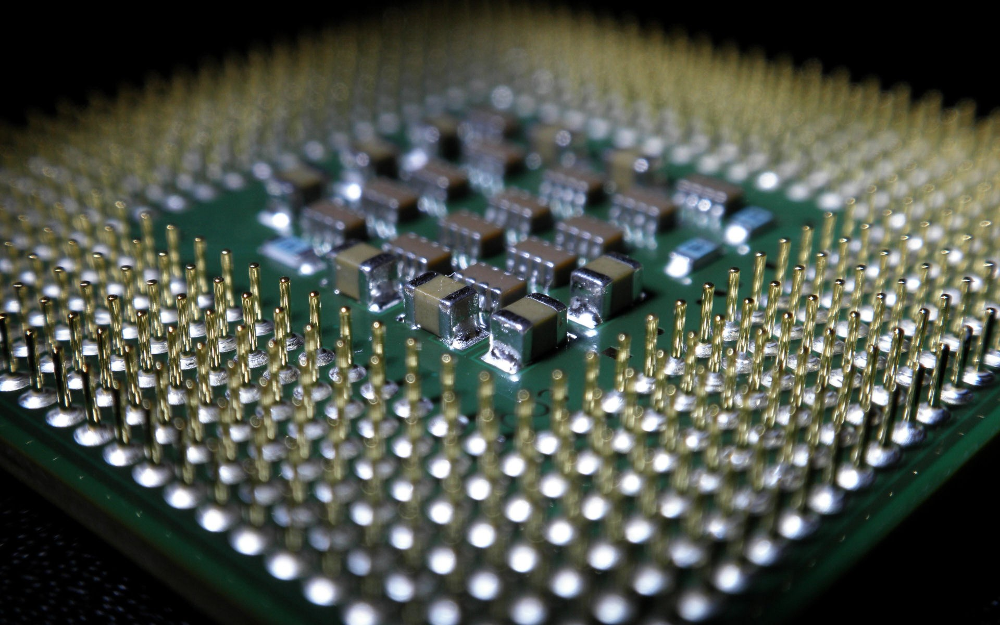

# <div> Five stages Pipeline Processor </div>

## 📝 Table of Contents

- [About <a name = "about"></a>](#about-)
- [Implemented Instructions <a name = "screen-video"></a>](#implemented-instructions-)
- [Contributors <a name = "Contributors"></a>](#contributors-)


## About <a name = "about"></a>

The processor in this project has a RISC-like instruction set architecture. There are eight 2-bytes general
purpose registers[ R0 to R7]. These registers are separate from the program counter and the stack pointer
registers.
The program counter (PC) spans the instructions memory address space that has a total size of 2
Megabytes. Each memory address has a 16-bit width (i.e., is word addressable). The instructions memory
starts with the interrupts area (the very first address space from [0 down to 2^5-1]), followed by the instructions area (starting from [2^5 and down to 2^20]) as shown in Figure.1. By default, the PC is initialized with a value of (2^5) where the program code starts.


## Implemented Instructions <a name = "implemented-instructions"></a>

## Implemented Instructions
### ☝️ One Operand
```
NOP
SETC
CLRC
NOT Rdst
INC Rdst
DEC Rdst
OUT Rdst
IN Rdst
```
### ✌️ Two Operands
```
MOV Rsrc, Rdst
ADD Rsrc, Rdst
SUB Rsrc, Rdst
AND Rsrc, Rdst
OR Rsrc, Rdst
SHL Rsrc, Imm
SHR Rsrc, Imm
```

### 💾 Memory
```
PUSH  Rdst
POP  Rdst
LDM  Rdst, Imm
LDD Rsrc, Rdst
STD Rsrc, Rdst
```

### 🦘 Jumps
```
JZ  Rdst
JN  Rdst
JC Rdst
JMP  Rdst
CALL Rdst
RET
RTI
```
### <svg xmlns="http://www.w3.org/2000/svg" width="16" height="16" fill="currentColor" class="bi bi-box-arrow-in-right" viewBox="0 0 16 16">
  <path fill-rule="evenodd" d="M6 3.5a.5.5 0 0 1 .5-.5h8a.5.5 0 0 1 .5.5v9a.5.5 0 0 1-.5.5h-8a.5.5 0 0 1-.5-.5v-2a.5.5 0 0 0-1 0v2A1.5 1.5 0 0 0 6.5 14h8a1.5 1.5 0 0 0 1.5-1.5v-9A1.5 1.5 0 0 0 14.5 2h-8A1.5 1.5 0 0 0 5 3.5v2a.5.5 0 0 0 1 0v-2z"/>
  <path fill-rule="evenodd" d="M11.854 8.354a.5.5 0 0 0 0-.708l-3-3a.5.5 0 1 0-.708.708L10.293 7.5H1.5a.5.5 0 0 0 0 1h8.793l-2.147 2.146a.5.5 0 0 0 .708.708l3-3z"/>
</svg> Input Signals
```
Reset
Interrupt
```


### Contributors <a name = "Contributors"></a>

<table>
  <tr>
    <td align="center">
    <a href="https://github.com/asmaaadel0" target="_black">
    
    <br />
    <sub><b>Asmaa Adel</b></sub></a>
    </td>
    <td align="center">
    <a href="https://github.com/Samaa-Hazem2001" target="_black">
    
    <br />
    <sub><b>Samaa Hazem</b></sub></a>
    </td>
    <td align="center">
    <a href="https://github.com/norhanreda" target="_black">
    
    <br />
    <sub><b>norhan reda</b></sub></a>
    </td>
    <td align="center">
    <a href="https://github.com/Hoda233" target="_black">
    
    <br />
    <sub><b>HodaGamal</b></sub></a>
    </td>
  </tr>
 </table>
